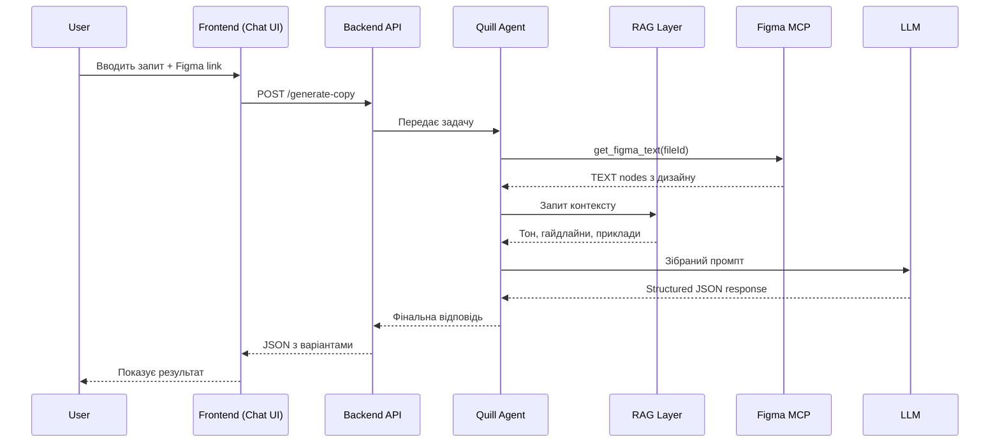

# 🚀 CopywrightRAG — AI-Powered UX Copywriting Tool

## 📋 Table of Contents

- [Overview](#overview)
- [Goals](#goals)
- [Core Components](#core-components)
- [Architecture](#architecture)
- [User Flow](#user-flow)
- [System Input & Output](#system-input--output)
- [Figma Integration (MCP)](#figma-integration-mcp)
- [RAG Layer](#rag-layer)
- [Quill Agent](#quill-agent)
- [LLM Layer](#llm-layer)
- [Prompt Strategy](#prompt-strategy)
- [API Design](#api-design)
- [MVP Constraints](#mvp-constraints)
- [Design Principles](#design-principles)
- [Implementation Plan](#implementation-plan)
- [Future Improvements](#future-improvements)

---

## 🧠 Overview

**CopywrightRAG** — це MVP AI-системи для UX-копірайтингу, що поєднує:

- **Quill Agent** — агент-копірайтер, який інтерпретує задачі і структурує вихід
- **RAG (Retrieval-Augmented Generation)** — шар знань: бренд, тон, гайдлайни
- **Figma Integration via MCP** — реальний UI-контекст з дизайнів
- **Pluggable LLM Layer** — підтримка OpenAI / Claude / Mistral / локальних моделей

Система хоститься як веб-додаток (GitHub Pages для фронтенду) з чат-інтерфейсом, де користувач може:

- Вставити посилання на Figma-файл
- Завантажити скріншот
- Описати задачу текстом

> **Мета:** Генерувати високоякісний UX-копі на основі реального контексту дизайну та бренд-гайдлайнів.

---

## 🎯 Goals

| # | Goal | Priority |
|---|------|----------|
| 1 | Генерація UX-копі для UI-екранів (кнопки, заголовки, лейбли) | 🔴 High |
| 2 | Використання реальних даних з Figma | 🔴 High |
| 3 | Дотримання бренд-тону та гайдлайнів | 🔴 High |
| 4 | LLM-agnostic архітектура | 🟡 Medium |
| 5 | Повернення кількох варіантів копі (1–3) | 🟡 Medium |
| 6 | Виправлення граматичних помилок | 🟡 Medium |
| 7 | Пояснення прийнятих рішень | 🟢 Low |
| 8 | Простота та розширюваність | 🟢 Low |

---

## 🧩 Core Components

### 1. Quill Agent (Brain)

Центральний агент системи:

- Інтерпретує задачу від користувача
- Вирішує, які інструменти викликати (RAG, Figma MCP)
- Структурує фінальний вихід (headline, CTA, labels)
- Генерує кілька варіантів копі

### 2. RAG Layer (Knowledge)

Забезпечує контекстні знання:

- Тон голосу бренду (Tone of Voice)
- UX-writing гайдлайни
- Продуктовий/бренд контекст
- Приклади текстів

**MVP реалізація:** in-memory JSON + базовий embedding + similarity search.

### 3. Figma Integration (via MCP)

Отримує реальний UI-контекст:

- Текстовий контент з дизайну
- Структура екрану (базова)
- Назви елементів

> ⚠️ Ми **не** використовуємо зображення — ми працюємо зі **структурованим текстом** (тільки TEXT nodes).

### 4. LLM Layer (Generation)

Абстрагований через інтерфейс:

```ts
interface LLM {
  generate(prompt: string): Promise<string>
}
```

Підтримувані моделі: OpenAI, Claude, Mistral, локальні моделі.

---

## 🏗️ Architecture

```
[Frontend Chat UI (GitHub Pages)]
            ↓
        [Backend API]
            ↓
       [Quill Agent]
            ↓
 ┌───────────────┬──────────────────┐
 ↓               ↓                  ↓
[RAG Layer]  [Figma MCP Tool]  [System Prompt]
 ↓               ↓                  ↓
 └────────────→ [LLM] ←────────────┘
                  ↓
             [Response]
```

**Ключові зв'язки:**

1. **Frontend** → надсилає запит на Backend API
2. **Backend** → передає запит Quill Agent
3. **Quill Agent** → оркеструє виклики RAG + Figma MCP
4. **Всі контексти** → збираються в промпт для LLM
5. **LLM** → генерує структуровану відповідь

---

## 🔄 User Flow



**Деталі:**

1. Користувач відкриває чат-інтерфейс
2. Надсилає запит (текст + Figma link / скріншот)
3. Quill Agent інтерпретує задачу
4. MCP Tool витягує текст з Figma: `get_figma_text(fileId)`
5. RAG повертає релевантні гайдлайни
6. Промпт збирається: user intent + RAG context + Figma UI data
7. LLM генерує структурований копі
8. Користувач отримує результат у чаті

---

## 📥📤 System Input & Output

### Input

| Тип | Опис | Обов'язковість |
|-----|------|----------------|
| `prompt` | Текстовий запит від користувача | ✅ Required |
| `figmaFileId` | ID файлу або посилання на Figma | ⚪ Optional |
| Screenshot | Зображення UI-екрану | ⚪ Optional |

### Output

Система повертає структуровану відповідь з трьома секціями:

#### 1. Copy Variants (1–3 варіанти)

```json
{
  "variants": [
    {
      "headline": "Complete your purchase",
      "cta": "Buy now",
      "labels": ["Total price", "Shipping address"]
    }
  ]
}
```

#### 2. Grammar Fixes

```json
{
  "fixes": [
    {
      "original": "Buy now fast",
      "corrected": "Buy now quickly",
      "rule": "Adverb usage"
    }
  ]
}
```

#### 3. Reasoning

```json
{
  "reasoning": [
    "Improved clarity of the headline",
    "Shorter and more actionable CTA",
    "Better alignment with UX writing best practices"
  ]
}
```

---

## 🔌 Figma Integration (MCP)

MCP (Model Context Protocol) використовується для підключення інструментів до агента.

### Figma Tool Definition

```json
{
  "name": "get_figma_text",
  "description": "Get UI text content from Figma file",
  "parameters": {
    "type": "object",
    "properties": {
      "fileId": { "type": "string" }
    },
    "required": ["fileId"]
  }
}
```

### Extracted Data Format

```json
[
  { "name": "Primary Button", "text": "Buy now" },
  { "name": "Label", "text": "Total price" },
  { "name": "Heading", "text": "Checkout" }
]
```

**Правила:**
- ✅ Тільки TEXT nodes
- ❌ Ігноруємо layout
- ❌ Ігноруємо стилі
- ✅ Фокус на семантичному тексті

---

## 🧠 RAG Layer

### Структура даних (MVP)

```ts
interface Document {
  id: string;
  text: string;
  category: "tone" | "guideline" | "example";
  embedding?: number[];
}

const docs: Document[] = [
  { id: "1", text: "Tone: friendly, concise, professional", category: "tone" },
  { id: "2", text: "CTA should be action-driven and clear", category: "guideline" },
  { id: "3", text: "Use 'Get started' instead of 'Sign up'", category: "example" }
];
```

### Процес Retrieval

1. Embed запит користувача
2. Порівняти з embedding'ами збережених документів (cosine similarity)
3. Повернути top-K релевантних документів

---

## 🤖 Quill Agent

Quill — це центральний копірайтинг-агент.

**Відповідальності:**

- Інтерпретація задачі від користувача
- Виклик необхідних інструментів (RAG, Figma MCP)
- Структурування виходу в заданому форматі
- Генерація кількох варіантів копі

**Принцип:** Agent-driven, not prompt-driven — агент сам вирішує, які інструменти використовувати.

---

## 🔤 LLM Layer

### Інтерфейс

```ts
interface LLM {
  generate(prompt: string): Promise<string>;
}
```

### Реалізації

```ts
class OpenAIProvider implements LLM {
  async generate(prompt: string): Promise<string> { /* ... */ }
}

class ClaudeProvider implements LLM {
  async generate(prompt: string): Promise<string> { /* ... */ }
}

class MistralProvider implements LLM {
  async generate(prompt: string): Promise<string> { /* ... */ }
}
```

---

## ✍️ Prompt Strategy

```text
You are a senior UX copywriter.

Brand context:
{{RAG_CONTEXT}}

UI context (from Figma):
{{FIGMA_TEXT}}

Task:
{{USER_PROMPT}}

Instructions:
1. Improve the existing UI copy
2. Provide 1–3 variants
3. Fix grammar issues
4. Explain your decisions

Return JSON with:
- variants (array of { headline, cta, labels })
- fixes (array of { original, corrected, rule })
- reasoning (array of strings)
```

---

## 📦 API Design

### Endpoint

```
POST /generate-copy
```

### Request Body

```json
{
  "prompt": "Rewrite checkout page copy",
  "figmaFileId": "abc123",
  "options": {
    "variantCount": 3,
    "fixGrammar": true,
    "includeReasoning": true
  }
}
```

### Response Body

```json
{
  "variants": [
    {
      "headline": "Complete your purchase",
      "cta": "Buy now",
      "labels": ["Total price", "Shipping"]
    }
  ],
  "fixes": [
    {
      "original": "Buy now fast",
      "corrected": "Buy now quickly",
      "rule": "Adverb usage"
    }
  ],
  "reasoning": [
    "Improved clarity",
    "Shorter, more actionable CTA"
  ]
}
```

---

## ⚠️ MVP Constraints

| Constraint | Reason |
|-----------|--------|
| ❌ No vector DB | Використовуємо in-memory для простоти |
| ❌ No full Figma parsing | Тільки TEXT nodes |
| ❌ No multi-agent system | Один агент (Quill) |
| ❌ No complex orchestration | Простий лінійний flow |
| ❌ No authentication | MVP без авторизації |
| ❌ No image analysis | Тільки текст з Figma |

---

## 💡 Design Principles

1. **Context > Model power** — якість контексту важливіша за потужність моделі
2. **Structure > Free text** — структурований вихід замість вільного тексту
3. **Simple > Scalable** — простота зараз, масштабування потім
4. **Agent-driven > Prompt-driven** — агент сам вирішує, які інструменти використовувати

---

## 🛠️ Technology Stack

| Component | Technology | Reason |
| :--- | :--- | :--- |
| **Frontend UI** | React, Vite, Tailwind CSS, shadcn/ui | Швидка розробка, сучасний UI, ідеально для SPA на GitHub Pages. |
| **Backend API** | Node.js, Express (або Hono), Zod | Надійність, типізація (TypeScript), легка валідація даних (Zod). |
| **Agent / LLM** | Vercel AI SDK (Core) | Вбудована підтримка багатьох моделей, проста генерація структурованого JSON. |
| **Figma / MCP** | `@modelcontextprotocol/sdk` | Офіційний стандарт для підключення інструментів (Figma) до AI-агентів. |
| **RAG (MVP)** | In-memory JS array + Cosine Similarity | Найпростіший спосіб реалізувати векторний пошук без розгортання окремої БД. |

---

## 📋 Implementation Plan

### Phase 0: Project Setup

| # | Task | Details |
|---|------|---------|
| 0.1 | Ініціалізація проєкту | Node.js (TypeScript), monorepo структура |
| 0.2 | Структура директорій | `src/agent`, `src/rag`, `src/mcp`, `src/llm`, `src/api`, `frontend/` |
| 0.3 | Налаштування інструментів | ESLint, Prettier, tsconfig |
| 0.4 | Конфігурація env-змінних | API keys, Figma token, LLM provider |
| 0.5 | Налаштування Tech Stack | Встановлення React, Vite, Express, Vercel AI SDK, MCP SDK |

**Структура проєкту:**

```
copywrightRAG/
├── PROJECT.md
├── package.json
├── tsconfig.json
├── .env.example
├── src/
│   ├── index.ts                  # Entry point
│   ├── config.ts                 # Environment configuration
│   ├── agent/
│   │   ├── quill.agent.ts        # Quill agent logic
│   │   └── agent.types.ts        # Agent interfaces
│   ├── rag/
│   │   ├── rag.service.ts        # RAG retrieval logic
│   │   ├── rag.data.ts           # In-memory knowledge base
│   │   └── rag.types.ts          # RAG interfaces
│   ├── mcp/
│   │   ├── figma.tool.ts         # Figma MCP tool
│   │   └── mcp.types.ts          # MCP interfaces
│   ├── llm/
│   │   ├── llm.interface.ts      # LLM abstraction
│   │   ├── openai.provider.ts    # OpenAI implementation
│   │   ├── claude.provider.ts    # Claude implementation
│   │   └── mistral.provider.ts   # Mistral implementation
│   ├── prompt/
│   │   └── prompt.builder.ts     # Prompt assembly logic
│   └── api/
│       ├── server.ts             # Express/Fastify server
│       └── routes.ts             # API routes
├── frontend/
│   ├── index.html                # Chat UI
│   ├── style.css                 # Styles
│   └── app.js                    # Frontend logic
└── data/
    └── knowledge.json            # Brand guidelines & tone
```

---

### Phase 1: LLM Layer 🔤

> **Мета:** Створити абстракцію для роботи з різними LLM.

| Step | Task | Деталі |
|------|------|--------|
| 1.1 | Визначити `LLM` інтерфейс | `generate(prompt: string): Promise<string>` |
| 1.2 | Реалізувати OpenAI provider | Використовуючи OpenAI SDK |
| 1.3 | Реалізувати Claude provider | Використовуючи Anthropic SDK |
| 1.4 | Створити factory function | `createLLM(provider: string): LLM` |
| 1.5 | Написати тести | Unit-тести для кожного provider |

---

### Phase 2: RAG Layer 🧠

> **Мета:** Побудувати систему контекстних знань.

| Step | Task | Деталі |
|------|------|--------|
| 2.1 | Створити `knowledge.json` | Тон, гайдлайни, приклади копі |
| 2.2 | Реалізувати embedding | Використовуючи OpenAI embeddings API |
| 2.3 | Реалізувати similarity search | Cosine similarity, in-memory |
| 2.4 | Створити `RAGService` | `retrieve(query: string): Promise<Document[]>` |
| 2.5 | Наповнити базу знань | 10–20 документів для MVP |

---

### Phase 3: Figma MCP Tool 🎨

> **Мета:** Інтегрувати Figma для отримання UI-контексту.

| Step | Task | Деталі |
|------|------|--------|
| 3.1 | Отримати Figma API token | Personal access token |
| 3.2 | Реалізувати `get_figma_text` | Виклик Figma REST API |
| 3.3 | Парсити TEXT nodes | Рекурсивний обхід дерева компонентів |
| 3.4 | Форматувати вихід | `Array<{ name, text }>` |
| 3.5 | Зареєструвати як MCP tool | MCP tool definition |

---

### Phase 4: Quill Agent 🤖

> **Мета:** Створити центрального агента-копірайтера.

| Step | Task | Деталі |
|------|------|--------|
| 4.1 | Реалізувати агент | Логіка оркестрації: RAG → Figma → Prompt → LLM |
| 4.2 | Prompt builder | Збирає промпт з усіх контекстів |
| 4.3 | Response parser | Парсить JSON-відповідь LLM |
| 4.4 | Error handling | Graceful fallbacks, retry logic |
| 4.5 | Інтеграційний тест | End-to-end: запит → відповідь |

---

### Phase 5: Backend API 🌐

> **Мета:** Побудувати REST API для фронтенду.

| Step | Task | Деталі |
|------|------|--------|
| 5.1 | Налаштувати Express/Fastify | Базовий сервер з CORS |
| 5.2 | Реалізувати `POST /generate-copy` | Головний ендпоінт |
| 5.3 | Input validation | Zod schema для request body |
| 5.4 | Error handling middleware | Стандартизовані помилки |
| 5.5 | Health check endpoint | `GET /health` |

---

### Phase 6: Frontend Chat UI 💬

> **Мета:** Створити чат-інтерфейс для користувачів.

| Step | Task | Деталі |
|------|------|--------|
| 6.1 | HTML-структура | Chat layout: input + messages |
| 6.2 | CSS стилізація | Сучасний мінімалістичний дизайн |
| 6.3 | JS логіка | Відправка запитів, рендер відповідей |
| 6.4 | Figma link detection | Автоматичне визначення Figma URL |
| 6.5 | Response rendering | Форматований показ варіантів, фіксів, reasoning |
| 6.6 | Deploy на GitHub Pages | Static hosting |

---

### Phase 7: Integration & Testing 🧪

> **Мета:** З'єднати всі компоненти та протестувати.

| Step | Task | Деталі |
|------|------|--------|
| 7.1 | End-to-end інтеграція | Frontend → API → Agent → LLM |
| 7.2 | Тестування з реальним Figma | Реальні дизайн-файли |
| 7.3 | Тестування різних LLM | OpenAI, Claude |
| 7.4 | Edge cases | Порожній Figma, невалідні запити |
| 7.5 | Performance testing | Час відповіді < 10s |

---

## 🗓️ Implementation Roadmap

```
Week 1: Phase 0 + Phase 1 (Setup + LLM Layer)
         ├── Project init, TypeScript config
         └── LLM interface + OpenAI provider

Week 2: Phase 2 + Phase 3 (RAG + Figma)
         ├── Knowledge base, embeddings, similarity search
         └── Figma API integration, text extraction

Week 3: Phase 4 + Phase 5 (Agent + API)
         ├── Quill agent orchestration
         └── REST API with Express

Week 4: Phase 6 + Phase 7 (Frontend + Testing)
         ├── Chat UI, GitHub Pages deploy
         └── Integration testing, bug fixes
```

---

## 🚀 Future Improvements

| Improvement | Priority | Complexity |
|-------------|----------|------------|
| Vector DB (Pinecone / Weaviate) | 🟡 Medium | Medium |
| Figma response caching | 🔴 High | Low |
| Screen type classification | 🟡 Medium | Medium |
| Multi-step agent reasoning | 🟢 Low | High |
| Brand voice fine-tuning | 🟡 Medium | Medium |
| UI hierarchy understanding | 🟢 Low | High |
| Screenshot/image analysis | 🟡 Medium | High |
| Authentication & user sessions | 🟡 Medium | Medium |
| Copy history & versioning | 🟢 Low | Medium |
| Figma plugin (write back copy) | 🟢 Low | High |

---

## 🔚 Summary

**CopywrightRAG** — це модульна AI-система для UX-копірайтингу, що поєднує:

> **Quill (агент) + RAG (знання) + Figma MCP (контекст) + LLM (генерація)**

Система забезпечує:

- ✅ Контекстно-усвідомлений UX-копірайтинг
- ✅ Генерацію копі на основі реального дизайну
- ✅ Масштабовану AI-архітектуру
- ✅ Чат-інтерфейс для зручної роботи
- ✅ LLM-agnostic підхід
