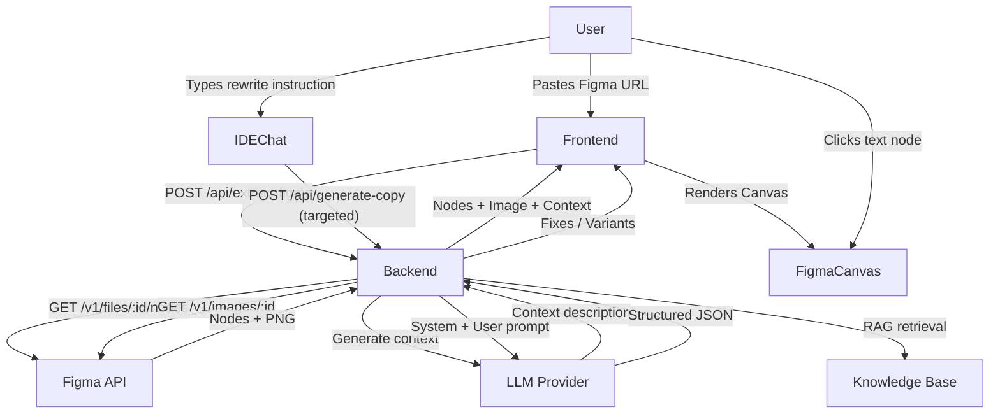

<div align="center">


# Quill

**AI-powered UX copywriting tool with Figma integration, RAG knowledge base, and pluggable LLM support.**

[Features](#features) · [Quick Start](#quick-start) · [Architecture](#architecture) · [Deployment](#deployment) · [Configuration](#configuration)

</div>

---

## Features

**Visual IDE Mode** — Connect your Figma design directly. Quill renders a pixel-perfect preview of your component with clickable text overlays. Select any text element and rewrite it with AI in one click.

**Classic Chat Mode** — A conversational interface where you describe what you want to change. The AI analyzes all text nodes in context and returns structured fixes and variants.

**RAG Knowledge Base** — Built-in Retrieval-Augmented Generation ensures every suggestion follows your brand's voice & tone guidelines, capitalization rules, and UX writing best practices.

**Pluggable LLM Providers** — Choose between OpenAI, Google Gemini, Anthropic Claude, or connect your own local/custom model via any OpenAI-compatible endpoint (Ollama, LM Studio, Groq, etc.).

**Privacy-First** — All API keys are stored in your browser's `localStorage` — never on the server. Run entirely local with Ollama for full data privacy.

---

## Quick Start

### Prerequisites
- **Node.js** v20+
- **npm** v9+
- (Optional) [Ollama](https://ollama.ai/) for local LLM inference

### Installation

```bash
git clone https://github.com/maksymilianAi/QuillRAG.git
cd QuillRAG

npm install
cd frontend && npm install && cd ..

cp .env.example .env
```

### Running Locally

```bash
# Terminal 1 — backend
npm run dev

# Terminal 2 — frontend
cd frontend && npm run dev
```

Open [http://localhost:5173](http://localhost:5173) in your browser.

---

## Architecture

<details>
<summary>File structure</summary>

<br>

```
QuillRAG/
├── api/                    # Vercel serverless functions
│   ├── _app.ts             # Shared Express app factory
│   └── [...path].ts        # Catch-all API handler
├── src/                    # Backend source code
│   ├── agent/              # Quill Agent (orchestrator) + Context Agent
│   ├── api/                # Express routes & server setup
│   ├── llm/                # LLM providers (OpenAI, Gemini, Claude, Local)
│   ├── mcp/                # Figma API integration (text + image extraction)
│   ├── prompt/             # Prompt builder with style rules
│   ├── rag/                # RAG service with embeddings
│   ├── config.ts           # Environment configuration
│   └── index.ts            # Application entry point
├── frontend/               # React + Vite + Tailwind CSS
│   └── src/
│       ├── components/
│       │   ├── ClassicChat.tsx    # Original chat interface
│       │   ├── VisualIDE.tsx      # IDE-style Figma canvas + chat
│       │   ├── FigmaCanvas.tsx    # Rendered Figma design with overlays
│       │   ├── IDEChat.tsx        # Targeted rewrite chat panel
│       │   ├── Sidebar.tsx        # Settings & mode switcher
│       │   └── ...
│       ├── api.ts           # API client functions
│       └── types.ts         # Shared TypeScript types
├── data/
│   └── knowledge.json      # RAG knowledge base (style guide)
├── vercel.json             # Vercel deployment config
└── package.json
```

</details>

<details>
<summary>Data flow</summary>

<br>



</details>

---

## Deployment

### Vercel (Recommended)

The project is pre-configured for one-click Vercel deployment:

1. Push your code to GitHub
2. Go to [vercel.com](https://vercel.com) → **Import Project**
3. Select your repository — Vercel will auto-detect `vercel.json` and deploy both frontend and API

> **Environment Variables (optional):** Add server-side fallback keys in Vercel Dashboard → Settings → Environment Variables. Users can always override with their own keys via the UI.

### Local Development

- **Backend** (`npm run dev`) — Express on `http://localhost:3001`
- **Frontend** (`cd frontend && npm run dev`) — Vite on `http://localhost:5173`, proxies `/api` to backend

---

## Configuration

### LLM Providers

All provider settings are configured via the Sidebar in the UI:

| Provider | What you need |
|----------|---------------|
| **OpenAI** | API Key (`sk-...`) |
| **Google Gemini** | API Key from [AI Studio](https://aistudio.google.com/) |
| **Anthropic Claude** | API Key (`sk-ant-...`) |
| **Local / Custom** | Base URL + Model Name (+ optional API Key) |

<details>
<summary>Local LLM examples</summary>

<br>

| Setup | Base URL | Model | API Key |
|-------|----------|-------|---------|
| **Ollama** | `http://localhost:11434/v1` | `llama3.2` | *(blank)* |
| **LM Studio** | `http://localhost:1234/v1` | `local-model` | *(blank)* |
| **Groq** | `https://api.groq.com/openai/v1` | `llama3-8b-8192` | `gsk_...` |

</details>

### Figma Integration

1. Go to Figma → Account Settings → Personal Access Tokens
2. Create a new token
3. Paste it in the **Figma Token** field in the Sidebar

### Environment Variables

```env
LLM_PROVIDER=openai          # Default provider: openai | claude | gemini
OPENAI_API_KEY=sk-...
ANTHROPIC_API_KEY=sk-ant-...
GOOGLE_API_KEY=...
FIGMA_ACCESS_TOKEN=figd_...
PORT=3001
```

---

## How It Works

<details>
<summary>Visual IDE Mode</summary>

<br>

1. **Extract** — Paste a Figma URL. The backend fetches the node tree and renders a PNG screenshot via Figma's Image Export API.
2. **Context** — The Context Agent analyzes all text labels and generates a 1–2 sentence description of the component.
3. **Select** — Click any text element on the canvas. The overlay highlights it and shows its name.
4. **Rewrite** — Type your instruction in the chat panel. The system sends only the selected text + context to the LLM.
5. **Apply** — The canvas updates automatically with the AI's suggestion.

</details>

<details>
<summary>Classic Chat Mode</summary>

<br>

1. Paste a Figma URL in the chat along with your instruction.
2. The agent extracts all text nodes, retrieves relevant style guidelines from the RAG knowledge base, and builds a comprehensive prompt.
3. The LLM returns structured JSON with `variants`, `fixes`, and `reasoning`.

</details>

<details>
<summary>RAG Knowledge Base</summary>

<br>

`data/knowledge.json` contains the brand's UX writing guidelines. These are embedded using Google's `text-embedding-004` model and retrieved on each request to ground the AI's suggestions in your actual style rules.

To update the knowledge base, edit `data/knowledge.json` and restart the server. Embeddings are generated lazily on the first request.

</details>

---

## Tech Stack

| Layer | Technology |
|-------|-----------|
| **Frontend** | React 19, Vite, Tailwind CSS 4 |
| **Backend** | Node.js, Express 5, TypeScript |
| **LLM** | Vercel AI SDK, @google/genai |
| **RAG** | Google text-embedding-004, cosine similarity |
| **Figma** | Figma REST API (files, nodes, images) |
| **Deployment** | Vercel (serverless functions + static) |

---

## License

MIT
