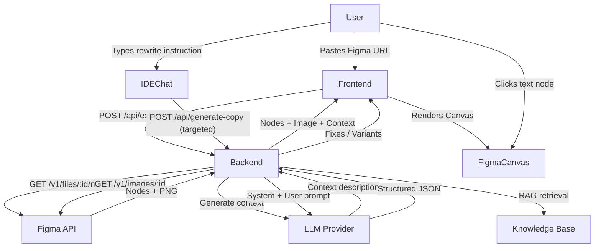

<div align="center">


# Quill

**AI-powered UX copywriting assistant with Figma integration and RAG knowledge base.**

</div>

---

Quill helps product teams write better UI copy — faster. Paste a Figma link or describe what you need, and Quill returns structured copy variants, grammar fixes, and reasoning grounded in your brand's style guide.

## What it does

**Visual IDE Mode** — Connect a Figma frame directly. Quill renders a preview with clickable text overlays — select any element and rewrite it with AI in one click.

**Classic Chat Mode** — Describe what you need in plain language. Quill returns structured variants, grammar fixes, and reasoning for every suggestion.

**Brand-aware** — Every suggestion follows your team's voice & tone guidelines, capitalization rules, and UX writing patterns — not generic AI copy.

**Your choice of AI** — Works with OpenAI, Google Gemini, Anthropic Claude, or any local model (Ollama, LM Studio, etc.).

**Private by default** — API keys stay in your browser. Run fully local with Ollama for complete data privacy.

---

## Getting started

1. Open the app and select your AI provider in the sidebar
2. Add your API key (stored locally in your browser — never on the server)
3. (Optional) Add a Figma Personal Access Token to use Visual IDE mode
4. Type a request or paste a Figma link and press Enter

> **Tip:** For best results, use Anthropic Claude — it handles structured copy output most reliably.

---

## For developers

<details>
<summary>Quick start</summary>

<br>

**Prerequisites:** Node.js v20+, npm v9+

```bash
git clone https://github.com/maksymilianAi/QuillRAG.git
cd QuillRAG

npm install
cd frontend && npm install && cd ..

cp .env.example .env
```

```bash
# Terminal 1 — backend
npm run dev

# Terminal 2 — frontend
cd frontend && npm run dev
```

Open [http://localhost:5173](http://localhost:5173).

</details>

<details>
<summary>Architecture</summary>

<br>

```
QuillRAG/
├── api/                    # Vercel serverless functions
│   ├── _app.ts             # Shared Express app factory
│   └── [...path].ts        # Catch-all API handler
├── src/                    # Backend source code
│   ├── agent/              # Quill Agent (orchestrator) + Context Agent
│   ├── api/                # Express routes & server setup
│   ├── llm/                # LLM providers (OpenAI, Gemini, Claude, Local)
│   ├── mcp/                # Figma API integration (text + image extraction)
│   ├── prompt/             # Prompt builder with style rules
│   ├── rag/                # RAG service with embeddings
│   ├── config.ts           # Environment configuration
│   └── index.ts            # Application entry point
├── frontend/               # React + Vite + Tailwind CSS
│   └── src/
│       ├── components/
│       │   ├── ClassicChat.tsx    # Original chat interface
│       │   ├── VisualIDE.tsx      # IDE-style Figma canvas + chat
│       │   ├── FigmaCanvas.tsx    # Rendered Figma design with overlays
│       │   ├── IDEChat.tsx        # Targeted rewrite chat panel
│       │   ├── Sidebar.tsx        # Settings & mode switcher
│       │   └── ...
│       ├── api.ts           # API client functions
│       └── types.ts         # Shared TypeScript types
├── data/
│   └── knowledge.json      # RAG knowledge base (style guide)
├── vercel.json             # Vercel deployment config
└── package.json
```

**Data flow:**



</details>

<details>
<summary>Deployment</summary>

<br>

**Vercel (Recommended)**

The project is pre-configured for one-click Vercel deployment:

1. Push to GitHub
2. Go to [vercel.com](https://vercel.com) → **Import Project**
3. Select your repository — Vercel auto-detects `vercel.json` and deploys frontend + API

> Add server-side fallback keys in Vercel Dashboard → Settings → Environment Variables. Users can override with their own keys via the UI.

**Local Development**

- Backend (`npm run dev`) — Express on `http://localhost:3001`
- Frontend (`cd frontend && npm run dev`) — Vite on `http://localhost:5173`, proxies `/api` to backend

</details>

<details>
<summary>Configuration</summary>

<br>

**LLM Providers**

| Provider | What you need |
|----------|---------------|
| **OpenAI** | API Key (`sk-...`) |
| **Google Gemini** | API Key from [AI Studio](https://aistudio.google.com/) |
| **Anthropic Claude** | API Key (`sk-ant-...`) |
| **Local / Custom** | Base URL + Model Name (+ optional API Key) |

Local LLM examples:

| Setup | Base URL | Model |
|-------|----------|-------|
| **Ollama** | `http://localhost:11434/v1` | `llama3.2` |
| **LM Studio** | `http://localhost:1234/v1` | `local-model` |
| **Groq** | `https://api.groq.com/openai/v1` | `llama3-8b-8192` |

**Figma Integration**

1. Figma → Account Settings → Personal Access Tokens → Create token
2. Paste it in the **Figma Token** field in the Sidebar

**Environment Variables (`.env`)**

```env
LLM_PROVIDER=openai          # Default provider: openai | claude | gemini
OPENAI_API_KEY=sk-...
ANTHROPIC_API_KEY=sk-ant-...
GOOGLE_API_KEY=...
FIGMA_ACCESS_TOKEN=figd_...
PORT=3001
```

</details>

<details>
<summary>How it works</summary>

<br>

**Visual IDE Mode**

1. Paste a Figma URL — backend fetches the node tree and renders a PNG via Figma's Image Export API
2. Context Agent analyzes all text labels and generates a 1–2 sentence component description
3. Click any text element on the canvas — overlay highlights it and shows its name
4. Type your instruction — system sends only the selected text + context to the LLM
5. Canvas updates automatically with the suggestion

**Classic Chat Mode**

1. Paste a Figma URL with your instruction
2. Agent extracts all text nodes, retrieves relevant style guidelines from the RAG knowledge base, builds a prompt
3. LLM returns structured JSON with `variants`, `fixes`, and `reasoning`

</details>

<details>
<summary>RAG Knowledge Base</summary>

<br>

`data/knowledge.json` contains the brand's UX writing guidelines. These are embedded using Google's `text-embedding-004` model and retrieved on each request to ground suggestions in your actual style rules.

To update: edit `data/knowledge.json` and restart the server. Embeddings are generated lazily on the first request.

</details>

<details>
<summary>Tech stack</summary>

<br>

| Layer | Technology |
|-------|-----------|
| **Frontend** | React 19, Vite, Tailwind CSS 4 |
| **Backend** | Node.js, Express 5, TypeScript |
| **LLM** | Vercel AI SDK, @google/genai |
| **RAG** | Google text-embedding-004, cosine similarity |
| **Figma** | Figma REST API (files, nodes, images) |
| **Deployment** | Vercel (serverless functions + static) |

</details>

---

## License

MIT
